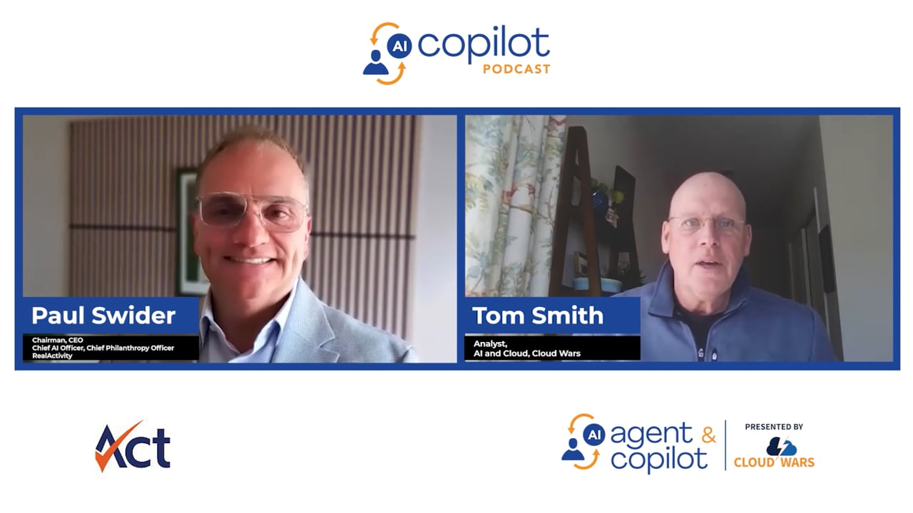

# 🧬 Tula - Your Personal Health AI Agent

<p align="center">
  <a href="https://agentandcopilot.com/cloud-wars-minute/ai-agent-and-copilot-podcast-openclaw-powered-healthcare-assistant-builds-patient-agency/">
    
  </a>
</p>

<p align="center">
  <strong>▶ Featured:</strong> Paul Swider on the <em>AI Agent &amp; Copilot Podcast</em> — <a href="https://agentandcopilot.com/cloud-wars-minute/ai-agent-and-copilot-podcast-openclaw-powered-healthcare-assistant-builds-patient-agency/"><em>OpenClaw-Powered Healthcare Assistant Builds Patient Agency</em></a> · 17 min · May 14, 2026
</p>

**Tula** is an open-source collection of [OpenClaw](https://github.com/openclaw/openclaw) skills, configurations, and patterns designed to transform a general-purpose AI agent into a personal health intelligence assistant.

Named after a brilliant, strong woman - a Mensa member and mother of five - Tula embodies sharp intelligence, warmth, and directness in service of one goal: **helping individuals take an active, informed role in their health.**

Tula is also designed to be deployed anywhere. It is open source, self-hosted, model-agnostic, and accessible through Telegram, which operates on low-bandwidth connections and basic smartphones worldwide. A community health center in rural Rwanda, a patient advocacy group in Brazil, or an individual managing a chronic condition in India can deploy the same platform used in a US academic medical center. Health equity requires not just better tools, but tools that are free, private, and available to everyone.

## Why This Matters

Tula exists because health is not abstract. Behind every biomarker is a person. Behind every caregiver is someone they love.

The people building this project are not doing so as a technical exercise. One of us is building Tula because he lost a parent to cancer and carries hereditary risk factors he is determined to monitor proactively. Another is building it because his wife is undergoing cancer treatment, and the demands of caregiving alongside daily life require better tools for tracking medications, understanding test results, and staying organized across multiple providers. Both need the same thing: an AI that consolidates health data, provides context, and highlights what matters, without selling it, sharing it, or placing it behind a subscription.

That is the core insight. The architecture that supports a healthy individual in tracking wellness metrics is the same architecture that supports a patient in managing treatment adherence, or a caregiver in coordinating complex care. It is not three different products. It is one platform that adapts to the user's needs.

Whether you are here to support long-term health, manage a condition, or help someone you love navigate a difficult diagnosis, Tula is designed to serve your needs.

Caregivers deserve dedicated support. Medication adherence, appointment coordination, treatment journaling, and caregiver wellbeing tracking are primary use cases for Tula, not secondary features.

## What Is This?

Tula is **not** a standalone application. It is a health-focused skill layer built on top of OpenClaw, providing the following capabilities.

Status legend used below: **(Live)** = deployed and ready on the reference VM; **(In Progress)** = actively being built; **(Planned)** = designed and committed to roadmap; **(Plan Documented)** = full architecture in [`docs/`](docs/) but no implementation yet. The [Project Status](#project-status) table below is the canonical source of truth.

- 🏥 **Electronic Health Record Integration (Live)** - Retrieval of medical history, visit summaries, conditions, medications, labs, and immunizations from patient portals via SMART on FHIR. Implemented in the [`health-records`](skills/health-records/) skill against MyChart, Oracle Health, Athena, and other ONC-certified portals. The skill that pulled my own hospital records on the first try.
- 📸 **Universal Photo / PDF Capture (Live)** - Email or upload any medical PDF, screenshot, or photo. Tula extracts structured data using multimodal AI without requiring FHIR access or IT involvement. Implemented in the [`med-pdf`](skills/med-pdf/) skill, which handles text-extractable PDFs (Quest, LabCorp) and image-only PDFs (MyChart exports) with the same pipeline.
- 🧪 **Laboratory Result Parsing (Live, via med-pdf)** - Automated extraction of biomarker values, units, and reference ranges from lab reports. Longitudinal trend tracking and out-of-range flagging. The dedicated structured-biomarker tracker skill remains on the roadmap.
- ✉️ **Patient Portal Message Drafting (Live)** - Draft concise, well-formatted MyChart-style messages to your care team for medication questions, lab follow-ups, refill requests, and symptom reports. Implemented in the [`epic-note`](skills/epic-note/) skill with refusal logic for emergency-flavored prompts.
- 📡 **Personal Health Pulse (Live)** - Aggregate configured signal feeds into a daily curated digest, scored against your personal topic preferences. Currently aggregates X (mentions and topic search) and Brave web search. Roadmap adapters cover wearables, portal inbox, calendar, email, and research feeds. Implemented in the [`myhealth-pulse`](skills/myhealth-pulse/) skill with the "Personal Data: Reference, Don't Embed" pattern.
- 📈 **Longitudinal Change Detection (Live)** - "What changed in my health since last week?" or "since I started lisinopril?" Tula reads your workspace memory (chart pulls, PDFs, dated notes, pulse digests) and produces a tiered diff (Tier 1 signal, Tier 2 notable, Tier 3 collapsed). Implemented in the [`memory-diff`](skills/memory-diff/) skill.
- 📧 **Intelligent Email Ingestion (In Progress)** - Forward health correspondence to Tula for automatic classification and routing to the right skill. Email security at the Exchange transport layer with sender and recipient allowlists. See the [security model](docs/security-model.md) for the boundary design.
- 📊 **Patient Health Dashboard (In Progress)** - Node web app served from the VM that renders a mobile-friendly view of FHIR data with live updates as new emails are processed. Designed for private access via Tailscale; no public exposure of health data. See the [dashboard build plan](docs/dashboard-build-plan.md).
- 📞 **Voice Calls (Plan Documented)** - Optional integration with Twilio to give the agent a phone number you call. The agent picks up, knows your records, and can carry a conversation. Architecture and setup walkthrough in [`docs/voice-integration.md`](docs/voice-integration.md); plugin not yet installed in the reference deployment.
- ⌚ **Wearable Device Integration (Planned)** - Daily physiological metrics (HRV, resting HR, sleep architecture, stress) from Garmin / Oura / Whoop / Withings / Apple Health, normalized into FHIR-shaped observations.
- 🩻 **Medical Image Interpretation (Planned)** - DICOM imaging studies (MRI, CT, X-ray, mammography, ultrasound) annotated by purpose-built healthcare imaging models (MedGemma multimodal / Microsoft MedImageInsight / CXRReportGen), with longitudinal comparison across sequential studies.
- 🧬 **Genomic Health Reports (Planned)** - Import and analysis of consumer genomic data (23andMe, AncestryDNA, clinical panels) correlated with current biomarker profiles.
- 🩺 **Home Health Device Integration (Planned)** - Bluetooth and Wi-Fi devices including BP monitors, body composition scales, pulse oximeters, and glucose meters for passive continuous monitoring.
- 📓 **Patient Health Journal (In Progress)** - Structured daily check-ins via Telegram for sleep, energy, mood, symptom burden, and treatment adherence.
- 💼 **Professional Journal (In Progress)** - Business note capture with automated daily summaries, weekly synthesis, and searchable history.
- 🔬 **Research Synthesis (Planned)** - Scheduled retrieval and summarization of current peer-reviewed literature relevant to your health profile and active protocols.
- 🗣️ **Voice Input (Planned)** - Speech-to-text transcription of Telegram voice messages. Medical voice via MedASR (5x more accurate than general-purpose transcription on clinical terminology); general voice via Whisper or Azure Speech.
- 🔒 **De-Identification (Planned)** - PHI removal from health documents prior to sharing or use in research contexts. Designed to support HIPAA Safe Harbor de-identification principles.
- 🧠 **Intelligent Model Routing (Partial)** - Each task is directed to the most capable, cost-effective, and privacy-appropriate model available. First-class support for **Microsoft** (Azure AI Foundry, Azure OpenAI, Azure Speech Services, MedASR), **OpenAI** (GPT family, o-series reasoning models, Whisper), and **Anthropic** (Claude family, direct API or via Azure AI Foundry). Any other state-of-the-art model that OpenClaw can route to works too (Google Gemini including Gemini Live for voice, xAI Grok, Mistral, DeepSeek, Cohere, Cerebras, Together, Fireworks, open-weight models via vLLM or local serving, and many more). The reference deployment today routes through `copilot-sdk` with Claude Sonnet 4.6 as the default and gpt-4o-mini as the cheaper eval baseline. Purpose-built healthcare model routing (MedGemma, MedImageInsight, CXRReportGen, MedASR) is on the roadmap. See the [model routing reference](docs/model-routing.md).

## Who Tula Is For

Tula supports patients navigating complex illness, caregivers, individuals managing chronic conditions, those with hereditary risk factors, community health programs in low-resource settings, and anyone focused on preventive health and wellness. See the [detailed use cases](docs/use-cases.md) for more information.

## Architecture

The diagram below distinguishes **live** components (deployed and ready on the reference VM) from **planned** components (on the roadmap). The [Project Status](#project-status) table is the canonical source of truth for individual component states.

```
User Interface
  |-- Telegram                                   (live)
  |-- Email outbound                             (live)
  |-- Email inbound auto-ingest                  (in progress)
  |-- Voice calls (Twilio + voice-call plugin)   (plan documented)
        |
Data Sources
  |-- Live
  |     |-- Patient portals via SMART on FHIR    -> health-records skill
  |     |-- Medical PDFs (lab, imaging, OCR)     -> med-pdf skill
  |     |-- X (Twitter) search                   -> @openclaw/xai-plugin
  |     |-- Brave web search                     -> @openclaw/brave-plugin
  |-- Planned
        |-- Email inbox auto-classify            (M365 / Graph API)
        |-- Wearables (Garmin, Oura, Whoop, Withings, Apple Health)
        |-- Home devices (BP, scale, pulse ox, glucose)
        |-- Genomic reports (23andMe, AncestryDNA)
        |-- Research feeds (PubMed, Google Scholar)
        |
OpenClaw Gateway  -- single self-hosted VM (Azure B2s, Ubuntu 24.04, ~$30/mo)
        |
Tula Skills  -- deployed under ~/.openclaw/workspace/skills/
  |-- Live (this repo, ✓ ready on reference VM)
  |     |-- health-records   -- SMART on FHIR records pull
  |     |-- med-pdf          -- PDF -> structured labs, imaging JSON
  |     |-- epic-note        -- draft portal messages to clinicians
  |     |-- myhealth-pulse   -- signal aggregation orchestrator
  |     |-- memory-diff      -- longitudinal change detection
  |-- Planned
        |-- email-router     -- inbound classification and routing
        |-- lab-parser       -- structured biomarker tracker beyond med-pdf
        |-- patient-journal  -- Telegram daily check-ins
        |-- professional-journal
        |-- wearable-sync    -- one adapter per device family
        |-- home-device-sync -- BP, scale, pulse ox, glucose
        |-- genomic-analyzer
        |-- medical-image-interpreter -- DICOM (MedGemma / MedImageInsight)
        |-- de-identification-engine  -- HIPAA Safe Harbor
        |-- research-synthesis        -- PubMed / Google Scholar summarization
        |
Agent Workspace Memory  -- ~/.openclaw/workspace/
  |-- MEMORY.md            -- persistent state (conditions, meds, providers, trends)
  |-- memory/YYYY-MM-DD.md -- dated agent notes
  |-- memory/profile.yaml  -- personalization profile (read by myhealth-pulse, etc.)
  |-- .health-records-cache/<date>/<provider>.json   -- FHIR R4 pulls
  |-- .med-pdf-cache/<slug>/                         -- PDF extractions
  |-- .myhealth-pulse-cache/<date>.json              -- pulse digests
  |-- .memory-diff-cache/<date>.md                   -- diff renderings
        |
Continuous Evaluation and Compliance  -- Microsoft Waza, this repo
  |-- evals/<skill>/eval.yaml + tasks/ + fixtures/   (open eval suites)
  |-- waza check         -- static compliance gate on every PR via CI
  |-- docs/evals.md      -- continuous status, regenerated by CI on every push
  |-- waza run (local)   -- live LLM execution; results/ gitignored
        |
AI Model Routing  -- deployment-context-aware; see docs/model-routing.md
  |-- Reference deployment today
  |     |-- Clinical reasoning: Claude Sonnet 4.6 (Anthropic, via copilot-sdk)
  |     |-- General tasks: gpt-4o-mini (OpenAI, via copilot-sdk)
  |-- First-class supported providers (any provider can serve any role)
  |     |-- Microsoft: Azure AI Foundry, Azure OpenAI, Azure Speech, MedASR
  |     |-- OpenAI:    GPT family, o-series reasoning, Whisper
  |     |-- Anthropic: Claude family (direct API or via Azure AI Foundry)
  |-- Other SOTA providers OpenClaw can route to
  |     |-- Google (Gemini, Gemini Live for voice), xAI (Grok), Mistral,
  |     |   DeepSeek, Cohere, Cerebras, Together, Fireworks, open-weight
  |     |   models via vLLM, and many more through the OpenClaw plugin system
  |-- Planned healthcare-specific routing
        |-- Voice loop: Gemini Live (via @openclaw/voice-call plugin)
        |-- Medical text: MedGemma 27B / Claude in Azure AI Foundry
        |-- Medical imaging: MedGemma 4B / MedImageInsight / CXRReportGen
        |-- Medical speech: MedASR / Azure Speech Services
```

The five live skills produce structured outputs (FHIR R4 JSON, extracted lab/imaging JSON, rendered digests) that land in the workspace memory layer. Other skills consume what is already there rather than re-fetching: `memory-diff` reads from the cache directories `health-records` and `med-pdf` write to, and `myhealth-pulse` writes its own daily cache that `memory-diff` includes in its scan. This composition is intentional and is what makes the agent feel like it knows you over time rather than like a transactional chatbot.

## Getting Started

### Prerequisites

- An [OpenClaw](https://github.com/openclaw/openclaw) instance (see our [Deployment Guide](docs/deployment-guide.md))
- An Azure VM (B2s is sufficient, approximately $30/month) or any server running Ubuntu 24.04 LTS
- A model provider OpenClaw can route to. First-class support for [Microsoft](https://azure.microsoft.com/en-us/products/ai-foundry) (Azure AI Foundry, Azure OpenAI), [OpenAI](https://platform.openai.com/) (GPT family, o-series), and [Anthropic](https://console.anthropic.com/) (Claude family). The reference deployment uses GitHub Copilot Pro via `copilot-sdk`. Any other [SOTA provider](docs/model-routing.md) that OpenClaw exposes also works.
- A Telegram account

### Quick Start

1. **Deploy OpenClaw** - Follow the [step-by-step deployment guide](docs/deployment-guide.md). The guide covers the complete process from Azure VM creation to Telegram integration. It is written to be accessible to administrators without prior Linux experience.

2. **Configure Email Ingestion** - The [email router design](docs/email-router-design.md) and [setup guide](docs/email-router-setup-guide.md) lay out the architecture and M365 / Entra ID / transport-rule steps. The [build plan](docs/email-router-build-plan.md) sequences the actual implementation work and replaces the himalaya client with Microsoft Graph API for cleaner OAuth and tighter integration with the existing Node-based skill scripts.

3. **Browse Your Health Data** - The [dashboard build plan](docs/dashboard-build-plan.md) describes a Node web app served from the VM that renders a beautiful, modern, mobile-friendly view of all email-ingested FHIR data — activity feed, lab trends, imaging reports, medications, appointments, with live updates as new emails are processed. Designed to be reachable privately via Tailscale; no public exposure of health data.

4. **Install Tula Skills** - Skills live under [`skills/`](skills/). Deploy them to your OpenClaw host with [`scripts/deploy-skills.sh`](scripts/deploy-skills.sh). See the [skills development guide](docs/skills-development.md) for details, conventions, and the testing workflow with Microsoft Waza. The continuous status of every shipped skill (compliance, spec, tokens, last live run) lives at [`docs/evals.md`](docs/evals.md) and is regenerated on every push by the [eval-status workflow](.github/workflows/eval-status.yml).

5. **Configure Data Sources** - Connect wearable and home health devices and configure check-in schedules.

## Project Status

This project is in **active development**. Five skills are live on the reference deployment and pass continuous Waza compliance checks. Status:

### Infrastructure

| Component | Status |
|-----------|--------|
| Deployment Guide | ✅ Complete |
| OpenClaw Setup | ✅ Complete |
| Telegram Integration | ✅ Complete |
| Email Security Model | ✅ Complete |
| Skills Authoring Framework (Waza + conventions) | ✅ Complete |
| Personal Data Reference Convention (privacy seam) | ✅ Complete |
| Continuous Eval Status (waza check + CI gate + docs/evals.md) | ✅ Complete |
| Deploy Tooling (deploy-skills.sh, aria-backup.sh) | ✅ Complete |

### Skills (deployed and ready on the reference VM)

| Skill | Status |
|-----------|--------|
| [`med-pdf`](skills/med-pdf/) (medical PDF parsing: labs, imaging) | ✅ Complete |
| [`epic-note`](skills/epic-note/) (patient portal messages) | ✅ Complete |
| [`health-records`](skills/health-records/) (SMART on FHIR records pull from MyChart / patient portals) | ✅ Complete |
| [`myhealth-pulse`](skills/myhealth-pulse/) (signal aggregation orchestrator across configured feeds) | ✅ Complete |
| [`memory-diff`](skills/memory-diff/) (longitudinal change detection over workspace memory) | ✅ Complete |

### Strategy artifacts

| Artifact | Status |
|-----------|--------|
| [Patient agent evaluation standard article](articles/how-will-you-know-if-your-patient-ai-is-working.md) | 📝 Draft |
| [Two-score framework article (governance + health portfolio)](articles/every-patient-ai-needs-two-scores.md) | 📝 Draft |
| [Voice integration architecture (OpenClaw + Twilio)](docs/voice-integration.md) | 📝 Plan documented |
| [Open-core scope split](OPEN_CORE.md) | ✅ Complete |

### Roadmap (skills and integrations not yet built)

| Component | Status |
|-----------|--------|
| Intelligent Email Ingestion and Router | 🔨 In Progress |
| Patient Health Dashboard (Node web app) | 🔨 In Progress |
| Laboratory Parser (structured biomarker tracker beyond med-pdf) | 🔨 In Progress |
| Patient Health Journal Skill | 🔨 In Progress |
| Professional Journal Skill | 🔨 In Progress |
| Wearable Device Integration | 📋 Planned |
| Medical Image Interpretation (DICOM) | 📋 Planned |
| Genomic Report Import | 📋 Planned |
| Home Device Sync (BP, Scale, Pulse Ox) | 📋 Planned |
| De-Identification Engine | 📋 Planned |
| Research Synthesis | 📋 Planned |
| Voice Calling (OpenClaw voice-call plugin install) | 📋 Planned |
| Healthcare Model Routing (MedGemma / MedASR / MedImageInsight) | 📋 Planned |
| MedASR Medical Speech | 📋 Planned |
| Voice Transcription (Whisper/MedASR) | 📋 Planned |
| Medication Adherence (IoT) | 💡 Community Idea |
| Caregiver Dashboard | 💡 Community Idea |

## Tula and Aria

Tula is maintained by RealActivity as an open-source project under the Apache License 2.0. RealActivity also develops **Aria**, a commercial hospital-scale platform built on the same Tula skills. The two are distinct products with distinct licenses:

- **Tula** is the public, Apache-2.0–licensed health agent skill collection and single-user reference deployment. It runs end-to-end on a single VM and is complete on its own.
- **Aria** is RealActivity's private, commercial multi-tenant platform for hospitals and health systems. It consumes Tula skills as a versioned dependency and adds the patient identity, ingest router, dashboard, LLM gateway, audit, and compliance plumbing required at hospital scale.

Contributions to Tula skills benefit both projects. The scope of what's maintained in this repo vs. what lives in Aria is documented in [`OPEN_CORE.md`](OPEN_CORE.md).

The open / closed split also applies to the evaluation infrastructure:

- **Open in this repo:** the eval suites under [`evals/`](evals/), the skill authoring conventions in [`skills/AGENTS.md`](skills/AGENTS.md), the Waza spec gates wired into [CI](.github/workflows/eval-status.yml), and the continuous compliance status at [`docs/evals.md`](docs/evals.md). These are intended as a vendor-neutral starting point for evaluating any patient-facing AI agent. See the draft article [`how-will-you-know-if-your-patient-ai-is-working.md`](articles/how-will-you-know-if-your-patient-ai-is-working.md) for the public framing.
- **Closed in Aria:** the continuous-execution layer that runs these evaluations per patient agent at hospital scale, the EHR-fidelity comparison engine that grounds the agent's view against the chart of record, the audit aggregation, and the governance score that composes those signals into a single number the quality officer can act on. See the draft article [`every-patient-ai-needs-two-scores.md`](articles/every-patient-ai-needs-two-scores.md) for the public framing of why the split lands where it does.

## Contributing

Contributions are welcome. Tula is built as a set of standard OpenClaw skills. Contributors familiar with OpenClaw can begin contributing immediately.

**Ways to contribute:**

- **Report issues** - If something does not work as expected, open an issue. Detailed bug reports are among the most valuable contributions at this stage.
- **Propose a health skill** - We are tracking community ideas in [Discussions](../../discussions).
- **Build a skill** - Read the [skills development guide](docs/skills-development.md) and use the [`med-pdf`](skills/med-pdf/) skill as the reference template. The [skills authoring conventions](skills/AGENTS.md) explain the OpenClaw-first / Waza-second priority rule. Submit a pull request.
- **Improve documentation** - The deployment guide was written during a real setup session. If any section is unclear or outdated, improvements are appreciated.

See [CONTRIBUTING.md](CONTRIBUTING.md) for detailed guidelines. See the [community skill ideas](docs/community-skills.md) for a full list of skills we would like to build.

## Principles

- **Patient empowerment through health literacy.** Tula translates clinical information into language that supports informed decision-making.
- **Data sovereignty.** All data is stored locally on the user's own server. No cloud health platforms. No third-party data sharing.
- **Intelligent model routing.** Each task is directed to the most capable model for that specific job. Purpose-built healthcare models for medical imaging and text. General-purpose reasoning models for clinical synthesis. The right model for the right task in the right deployment context.
- **Caregiver recognition.** Caregiver support is a core use case, not a secondary consideration.
- **Global health equity.** Open source, self-hosted, model-agnostic, and accessible on low-bandwidth networks. Designed so that a clinic in a low-resource setting has access to the same tools as a patient in a high-income country.
- **Defense in depth.** Email ingestion is locked to authorized senders at the Exchange transport layer. Outbound email is restricted to authorized recipients. Prompt injection risks are analyzed honestly and mitigated at multiple layers. See the [security model](docs/security-model.md).

See the [full principles](docs/principles.md) for our complete set of values and commitments.

## Cost

Running Tula costs approximately **$35 - $115/month** depending on usage, from text-based journaling and laboratory parsing at the low end to medical image interpretation and genomic analysis at the high end. No subscription fees. No platform lock-in. Users provide their own API keys. See the [cost guide](docs/cost-guide.md) for a detailed breakdown.

Optional voice calling adds Twilio carrier fees (around $1/month for a US local number plus per-minute usage) and voice-model usage on top. A heavy personal user lands in the $30 to $60/month range above the base figure; light users stay under $10. See [`docs/voice-integration.md`](docs/voice-integration.md) for the full cost and latency breakdown.

## Background

This project originated as a personal build by a Windows Server administrator of 25 years deploying his first native Linux server to run an AI health agent. The [deployment guide](docs/deployment-guide.md) was written in real time as issues were encountered and resolved. It documents the actual experience, including common errors and their solutions.

Tula is a [RealActivity](https://realactivity.ai) initiative.

## Founding Contributors

- **Paul Swider** - Creator. Health data integration, laboratory parsing, wearable integration, infrastructure.
- **Sal Rosales** - Medical adherence, caregiver tools, IoT integration.

## License

Apache License 2.0 — see [LICENSE](LICENSE) and [NOTICE](NOTICE). The code is free to use, modify, and distribute under the terms of the license, including its explicit patent grant and patent-retaliation clause. Tula was relicensed from MIT to Apache 2.0 in May 2026 to add contributor patent protections; the `skills/health-records/` subdirectory retains its upstream MIT terms (see [NOTICE](NOTICE) for full attribution). Tula will remain Apache-2.0-licensed going forward.

"Tula" and "RealActivity" are trademarks of RealActivity. The Apache 2.0 license covers the code, not the name. See [TRADEMARK.md](TRADEMARK.md) for details.

RealActivity is also developing **Aria**, a commercial hospital-scale platform built on the same Tula skills. Aria is private and proprietary; Tula remains open source. See [`OPEN_CORE.md`](OPEN_CORE.md) for the scope boundary between the two.

## Disclaimer

Tula is an open-source software tool intended to support personal health data organization and health literacy. It is not a medical device, not FDA-cleared or approved, and not intended to diagnose, treat, cure, or prevent any disease or medical condition. Tula does not provide clinical decision support and should not be used as a substitute for professional medical advice, diagnosis, or treatment. Always seek the guidance of qualified healthcare providers with any questions regarding a medical condition. If you are experiencing a medical emergency, contact your local emergency services immediately.

---

*Your health. Your data. Your AI. Whatever your journey, Tula is here to help.* 🧬
