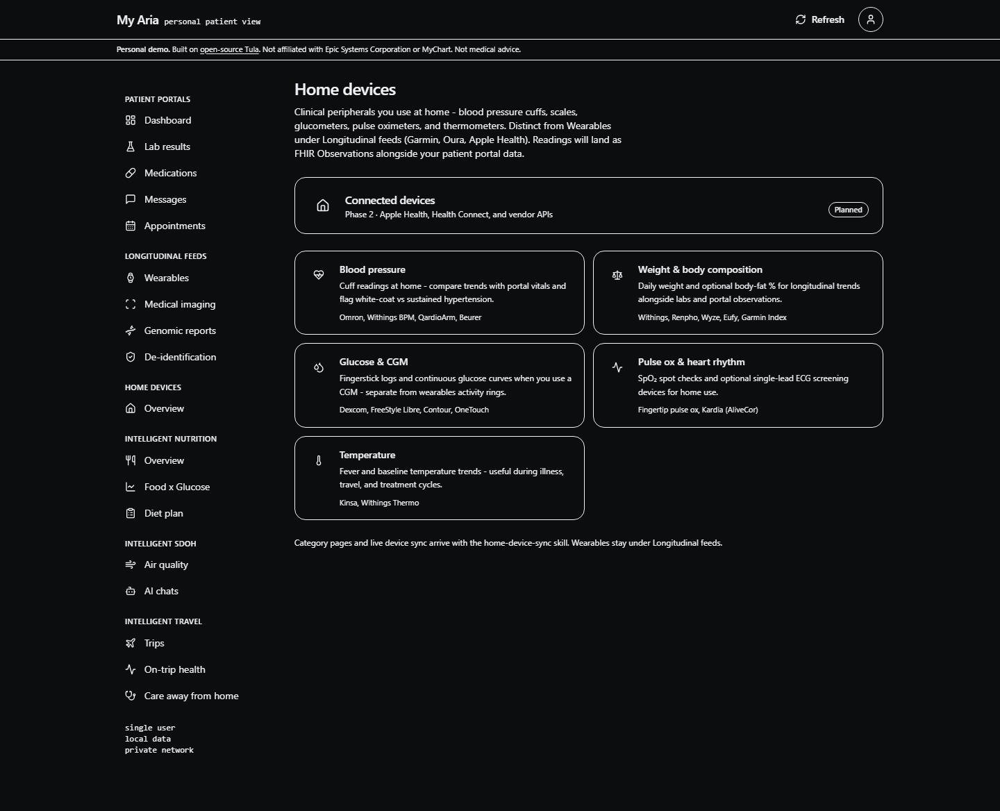

# I Built the Patient Portal My Agent Deserves

*Epic spent decades teaching you to log into their chart. I spent an afternoon teaching my agent to show me mine - on my server, from five hospitals, with a sidebar that knows the difference between a portal, a Garmin, and a ZIP code.*

*May 20, 2026*

Two weeks ago I wrote about the day SMART on FHIR worked on the first try. OAuth to a real hospital, encrypted bundle, full medical history dropped onto a Linux box I control. That story ends where most health-tech demos end - with proof that the pipe works.

It does not end with proof that *you* can live inside the pipe.

A JSON dump is not a patient experience. LOINC codes in a folder are not a longitudinal record you can scan two minutes before a cardiology follow-up. An agent that *knows* you still owes you a surface - calm, dense, mobile-friendly - where you can see what it knows without opening a terminal. So I built one. I call it **My Aria**. It is deliberately not called MyChart.

## What I refused to build, and the three names you need

My Aria lives in the open-source [Tula](https://github.com/realactivity/tula) repo beside `aria-web`, the activity-feed sibling. Same stack: Next.js 15, TypeScript, Tailwind v4, dark-first, burgundy accent, Motion for entrance animations. Same FHIR types the email-router writes to disk. Dev runs on port 3002 so the two apps coexist.

Three names do real work in this story and they are not interchangeable, so let me draw the line once:

- **Tula** is the open-source agent and skill layer running on my VM under Apache 2.0. It is the thing that performs the SMART on FHIR pull, parses the Quest PDF, drafts the portal reply, and runs the daily pulse. The agent persona is named Tula.
- **My Aria** is what this article is about: an open-source personal patient-portal UI in `apps/my-aria/` that sits *on top of* Tula. It is the surface you and your caregivers look at. It is a RealActivity sub-brand. It is not Epic, not MyChart, not a medical device.
- **Aria** (no "My") is RealActivity's separate, proprietary hospital-scale platform - one agent per patient under multi-tenant governance, what we call a Patient Swarm. Different repo, different license, not this article.

What My Aria is *also* not: a replacement EHR, a clinical decision support system, or a product hospitals deploy to thousands of patients. The disclaimer on every page says so, in one line under the header and again at the bottom of the dashboard. Personal demo. Open-source Tula skills, RealActivity sub-brand UI. Not affiliated with Epic Systems Corporation or MyChart. Talk to your doctor about anything that matters.

I can describe the *design language* of a hospital portal - clinical calm, information density, burgundy if you grew up in that ecosystem - without putting anyone else's name on the navigation bar. RealActivity's trademark policy is explicit: fork the code, not the brand. That applies in both directions.

## A sidebar that encodes data sovereignty

The breakthrough was not a prettier lab card. It was **taxonomy**.

Most patient portals organize around what the *hospital* documents: results, meds, messages, appointments. That is correct for one institution. It is wrong for a person who will connect multiple portals over a lifetime, wear a Garmin, push values from a kitchen-counter blood pressure cuff, forward lab PDFs from Quest, live in a ZIP code with bad air quality, and tell an agent on Telegram that groceries have to last until the third.

My Aria's left navigation is organized by **where data comes from**, not by which Epic module it mimics:

**Patient portals** - Dashboard, lab results, medications, messages, appointments. FHIR-shaped chart data from SMART on FHIR pulls: one or many hospitals, same UI. The plural matters. I am not building for a single health system; I am building for a person who will accumulate portals across a lifetime of moves, employers, and specialists.

**Longitudinal feeds** - Wearables (Garmin, Oura, Whoop, Withings, Apple Health), medical imaging, genomic reports, and de-identification for when you want to share a redacted copy with another AI or a researcher. Continuous and semi-continuous streams that are *not* the hospital chart and do not deserve to be flattened into one.

**Home devices** - One hub page, not five sidebar links. Blood pressure cuffs, scales, glucometers, pulse oximeters, thermometers. Clinically different from wearables: episodic peripherals you use at home, often the numbers your PCP actually quotes back to you. I renamed "Device integration" to **Wearables** under Longitudinal feeds so I would stop conflating a Garmin with an Omron.

**Intelligent Nutrition** - MyFitnessPal feeds the meal log; Tula does the rest. Three slots: Overview (today's calories, macros, fiber, hydration), Food x Glucose (CGM curves overlaid with logged meals), and Diet plan (clinician-recommended pattern scored against actual intake). Food x Glucose earns its own sidebar slot because no patient portal does that correlation.

**Intelligent SDOH** - Air quality and demographics by ZIP (demo fixtures today; AirNow and Census ACS tomorrow), plus **AI chats**: social-determinant signals extracted from agent conversations - transportation gaps, food insecurity, housing instability - with evidence strings and ICD-10 Z codes where they apply. The chat history is a social-determinant data source. Nobody's portal has a tab for that.

**Intelligent Travel** - Business and personal trips as health perturbations. Three slots: Trips (the hub - itineraries, destination brief, travel journal, and return checklist live one click deep), On-trip health (wearable signals vs home baseline), and Care away from home (urgent care, pharmacy refills, telehealth in the ZIP you are in). Same compression pattern Home devices uses, so the menu does not scroll forever.

Mobile keeps a bottom nav with only the five portal pages. The depth lives on desktop. That is the right trade for a power user building on a VM, with Cloudflare Access for caregivers later.

## What you see on the dashboard

The home screen is not an activity feed clone. It is a **command surface**.

Welcome and last-refresh timestamp at the top. Full-width upcoming appointment card (I removed the fake account balance - it was demo noise pretending to be a feature). Recent labs with Recharts sparklines, glucose flagged amber when it drifts. Active medications. Quick actions to schedule a visit, message a provider, request a refill, or export FHIR JSON. Below that, two capability sections - Longitudinal feeds and De-identification - with honest "planned" badges instead of vapor.

Data today is synthetic fixtures shaped exactly like production. `getDashboardData()` is the only seam; when the email-router writes real JSON beside my health-records cache, the UI does not move. Markdown is for welcome copy and disclaimers only - never for clinical values. The clinical trunk stays FHIR.

The production build passes twenty-three static routes. `npm run typecheck` is clean. A Playwright script - `npm run screenshot` - boots the app and saves the dashboard to `public/my-aria-dashboard.png` so the README and this article never go stale.

## Why this is the necessary next layer

Tula's thesis is patient agency: your health, your data, your AI. The health-records skill proves legal access. The med-pdf and epic-note skills prove a Tula agent can operationalize what arrives. My Aria proves there is a **durable visual layer** where those capabilities compound - where a caregiver can open a URL and understand the same longitudinal story Tula sees, without learning a new chat protocol or trusting a vendor cloud.

Hospitals will need governed infrastructure for patient agents at scale; that is the commercial Aria path, a separate repo and a different license. But the personal cell - one person, one VM, Tula on the back, My Aria on the front, one sidebar that distinguishes portal from Garmin from ZIP - has to exist first. You cannot ask a health system to adopt a patient-agent platform you have never lived in yourself.

There is a quieter point under the taxonomy. The reason a portal cannot be a Garmin and a Garmin cannot be a ZIP code is not visual. It is governance. Each source has a different consent posture, a different retention story, a different identifier graph, a different legal basis for sharing onward. A sidebar that pretends they are the same trains users to consent the same way, and that is how we got here.

If SMART on FHIR is the pipe and Tula is the plumbing, My Aria is the faucet. Not Epic's faucet. Not the hospital's faucet. Yours.

The repo is [github.com/realactivity/tula](https://github.com/realactivity/tula), app under `apps/my-aria/`, dev on port 3002. The dashboard screenshot is in the repo at `apps/my-aria/public/my-aria-dashboard.png`. Steal the sidebar taxonomy if you are building on Tula. Tell me which home device you would wire first - cuff, scale, or CGM - and I will prioritize the home-device-sync skill accordingly.

- Paul

---

*My Aria is open-source software for personal health organization and health literacy. It is not a medical device, not FDA-cleared, and not intended to diagnose, treat, cure, or prevent any disease. Always work with qualified healthcare providers for medical decisions.*
